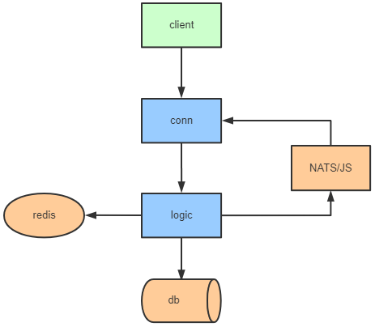
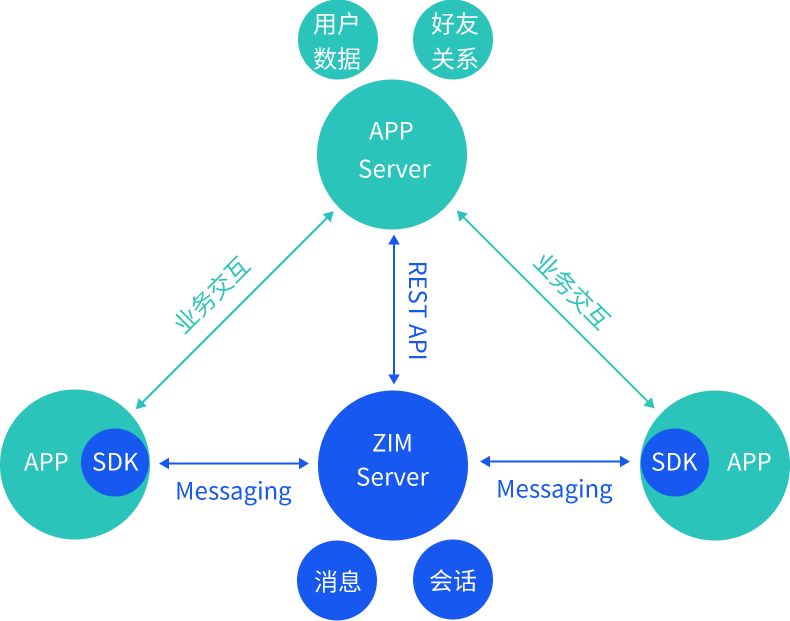

# zim
Instant messaging system in Go. 使用 zoo 框架打造的一款易学、易通、易掌控的即时通讯系统

## Architecture

## Protocol

| Name          | Length        |  Remark                 |
|:--------------|:--------------|:------------------------|
| HeaderLen     | 4 bytes       | header length           |
| Version       | 4 bytes       | protocol version        |
| Cmd           | 4 bytes       | command for request     |
| Seq           | 4 bytes       | sequence id             |
| BodyLen       | 4 bytes       | body length             |
| Body          | BodyLen bytes | protobuf binary bytes   |

## 与应用集成

ZIM 是一套开源通用的即时通讯产品，您可以通过简易的方式将 ZIM SDK集成进自有应用中，配合服务端 REST API 调用，即可轻松拥有强大的即时通信能力。即时通信 IM 服务和您的应用之间的交互如下图所示：

从上图可以看到，ZIM 服务器并不托管用户数据与好友关系，这些数据都保存在应用服务器上，ZIM 服务器仅仅只是充当信使的角色。